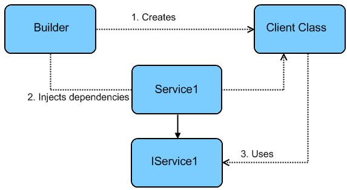

[transition=zoom, %notitle]
= Kodein: KOtlin DEpendency INjection
:source-highlighter: highlightjs
:revealjs_theme: sky
:revealjs_history: true
:revealjs_previewLinks: true

== My name is...

Salomon BRYS

* Kotliner for 3 years
* Author & maintainer of Kodein

=== I work at...

*http://www.dental-monitoring.com/[Dental Monitoring]*.

== Dependency Injection

[quote, Wikipedia]
____
Dependency injection separates the creation of a client's dependencies from the
client's behavior, which allows program designs to be loosely coupled and to
follow the dependency inversion and single responsibility principles.
____

=== Dependency Injection

_Source: Microsoft_

== What can you inject ?

[%step]
* Business managers
* Presenters (in MVP)
* OS services
* Anything that can be abstracted!

== DI libraries: Dagger 2

[WARNING]
====
Dagger 2 is a valid solution, widely used and very reliable.

All views expressed here are those of the author only. +
Please research the solution that's right and do NOT trust my word only ;)
====

=== Dagger 2: Validation at runtime

Allows all dependencies to be checked before compilation :)

[%step]
* You need to declare all injected classes
* Weird compilation errors (missing dependency, circular dependency, etc.)
* Less flexibility

=== Dagger 2: Annotation based

[%step]
* Module configuration through annotations.
* Unsemantic binding syntax.
+
[source, kotlin]
----
@Singleton
fun provideManager(net: Network, user: User): Manager
    = ManagerImpl(net, user)
----

== DI libraries: Guice

[%step]
* Depends on Guava.
* Adds 13k+ methods.
* Annotation based.

== Goals for DI in Kotlin

[%step]
* Semantic (simple declarative DSL).
* Idiomatic (best use of the Kotlin language)
* Easy (to use & bootstrap).
* Debuggable (understandable errors).
* Android friendly (duh).
* Java friendly (for legacy code).
* Documented (heavily).

=== DI library in Kotlin

[quote, A random #perfmatters activist]
____
How about optimized?
____

[%step]
* Yes, #perfmatters, *but only in critical path* (see the latest ART)
* The very majority of times, DI is *not a critical path*!
* In DI, readability and debuggability are way more important !

[transition=zoom]
== KODEIN

image::Kodein-logo.png[KODEIN]

https://github.com/SalomonBrys/Kodein

=== Kodein: History

[%step]
* Version 1.x (from apr. 2015): Concept
* Version 2.x (from oct. 2015): Robust API
* Deprecation of Injekt (26 jun. 2016)
* Version 3.x (jul. 2016): Core reshaping & lots of features.
* Version 4.x (jun. 2017): Compatible with JS.

=== Kodein: External Contributors

Mainly

* *Jayson Minard* (author of injekt) from Collokia, lots of help & insight.
* *Eliezer Graber* from Insite Applications, huge investment in the Android module.

But also a lot of other smaller contributions from the community.

=== Kodein: Documentation

*RTFM!*

https://salomonbrys.github.io/Kodein/

== A bit of Kotlin

To understand the magic

=== Kotlin: Infix functions

[source, kotlin]
----
user registers event at noon

user.register(event).at(noon)
----

=== Kotlin: reified types

[source, kotlin]
----
inline fun <reified T> instance(): T
    = container.getInstance(T::class.java)

val manager = instance<Manager>()
----

=== Kotlin: inferred (reified) types

[source, kotlin]
----
inline fun <reified T> instance(): T
    = container.getInstance(T::class.java)

val manager: Manager = instance()
//           └─────────────────┘
----

== KODEIN

image::Kodein-logo.png[KODEIN]

Let's code, dammit!

== KODEIN

* Semantic (simple declarative DSL).
* Idiomatic (best use of the Kotlin language)
* Easy (to use & bootstrap).
* Debuggable (understandable errors).
* Android friendly (duh).
* Java friendly (for legacy code).
* Documented (heavily).

=== !

image::Kodein-logo.png[KODEIN]

*Thank you!*
